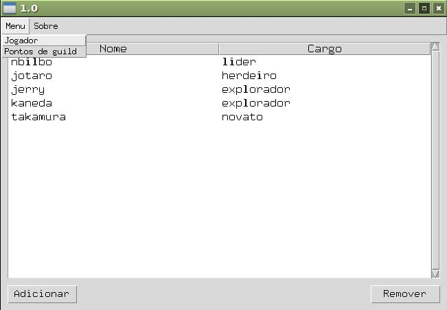
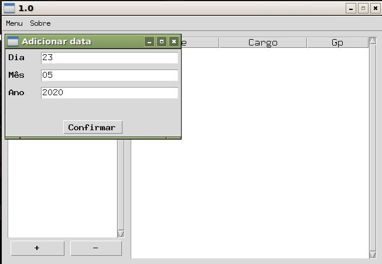

<h1>guildws</h1>

<h2>Pastas</h2>

* control
  * Aqui é onde esta o código responsável por criar o arquivo .db3, verificar a existencia do arquivo .db3, executar queries.
* model
  * Aqui esta o arquivo de texto com o script usando p/ criar o banco e onde ficará salvo o arquivo .db3.
* view
  * O arquivo programa.py responsável por inicializar o programa principal se encontra aqui.

<h2>requisitos:</h2>

* python 2x ou python 3x

* sqlite3

<h2>Adicionando jogadores.</h2>

**Tela inicial.**

  
  
**Podemos adicionar um novo jogador clicando no botão 'Adicionar' do canto inferior esquerdo.**

**Depois de adicionando, clicando 2x sobre seu nome, é possivel editar as informações do jogador.**

  

**Para deletar um jogador, basta seleciona-lo e clicar no botão 'Remover' no canto inferior direito.**

<h2>Adiciando o gp</h2>

**É possivel navegar entra as telas pela barra de menu.**

**Primeiro, temos que clicar no botão com o sinal "+" que se encontra no lado esquerdo inferior**

**Sera adicinado um novo item corresponde a data criada. Se clicarmos 2x com o mouse em cima, é possivel visualizar o gp de todos os jogadores.**

**Para atualizar o gp, basta clicar 2x com o mouse sobre o nome do jogador.**

